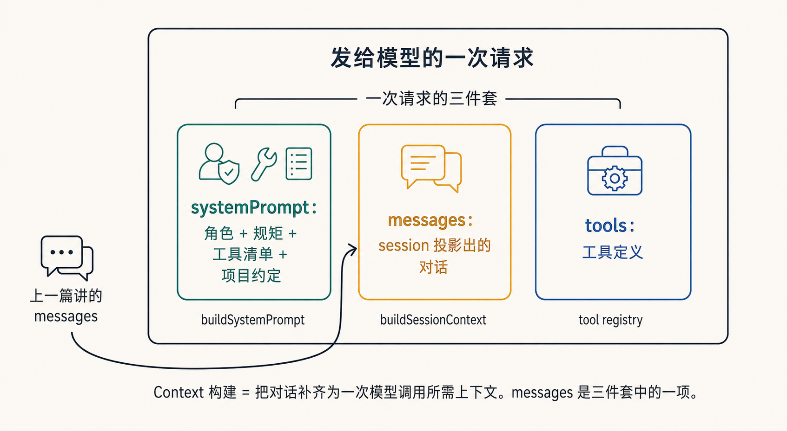
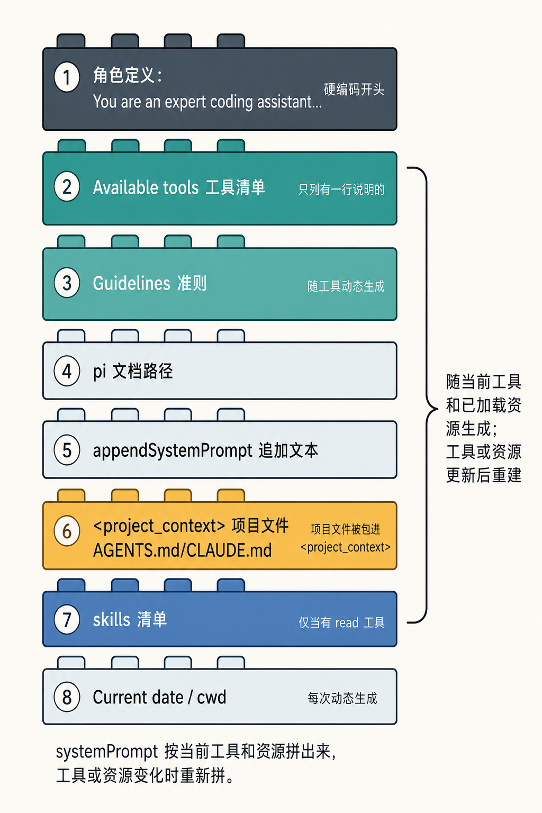
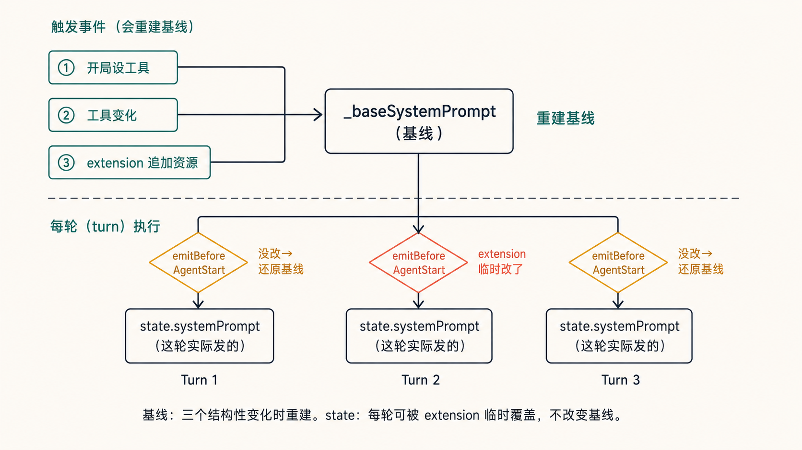
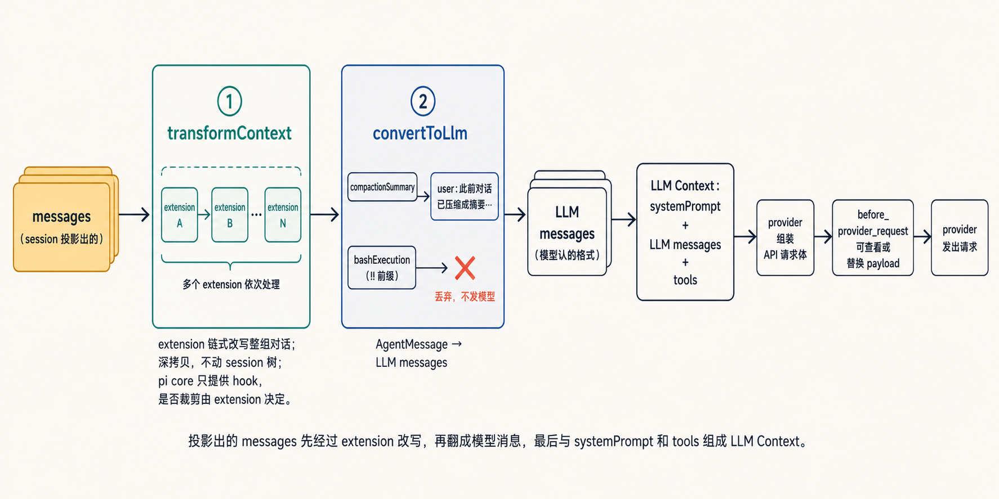
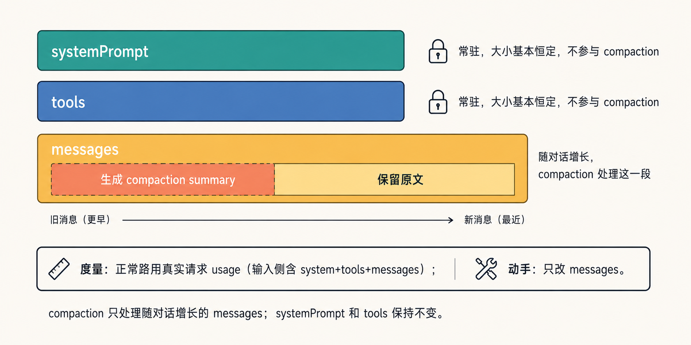
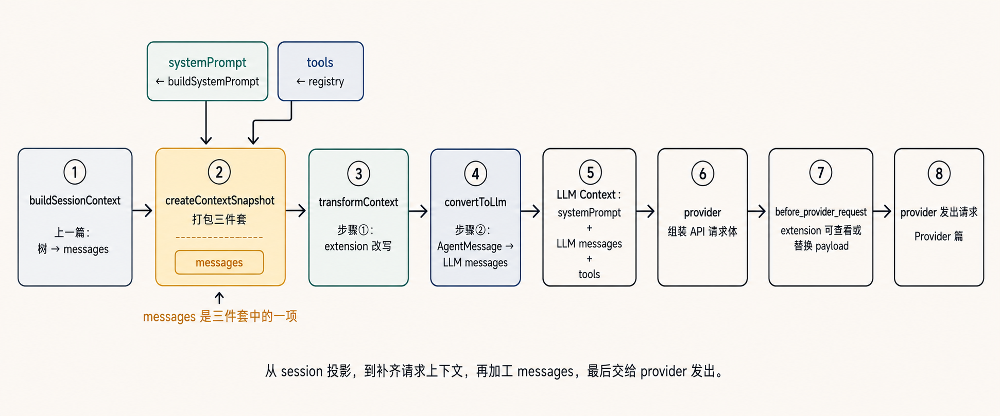

# Pi 系列 08｜Context 构建：发给模型的输入怎么拼出来

本系列其他文章：

placeholder

> 本文源码主要在 `core/system-prompt.ts`、`core/messages.ts`、`extensions/runner.ts`、`agent.ts` 和 `agent-loop.ts`，以及 `agent-session.ts`、`compaction/compaction.ts`、`core/sdk.ts` 和 provider 实现。

上一篇讲 session：对话存成一棵树，`buildSessionContext` 从当前 leaf 投影出一串 messages。

接下来引入一个问题：

**这串 messages 是否就是发给模型的全部输入？**

答案：**不是**。

用一个普通协作场景类比：只给别人聊天记录，通常还不够。对方还需要知道任务边界、项目约定、可用工具和已有流程。模型也是一样。

pi 里，agent loop 使用的请求上下文是一个三件套：

```ts
AgentContext = {
  systemPrompt: string,        // 系统提示：角色、规矩、工具清单、项目约定
  messages: AgentMessage[],    // 对话：session 投影出来的那串
  tools: Tool[],               // 工具定义：模型能调用的工具
}
```

`createContextSnapshot()` 就是把这三样打包成一次请求。**Context 构建，就是把 session 投影出的对话，补齐为一次模型调用所需上下文的过程。** 

所以咱们按这条线来看一下：systemPrompt 怎么拼出来、messages 发出前还要过哪几个步骤、为什么说"不只是 messages"。

<!-- 图1：三件套
生图 prompt：
一张横版示意图，现代技术插画风格，温白背景 #F7F3EA，深蓝灰细线描边 #263238，无强渐变无厚重阴影，中文标签清晰。
中间画一个大方框标「发给模型的一次请求」，里面并排三个卡片：卡片1 用蓝绿色 #2A9D8F 标「systemPrompt：角色 + 规矩 + 工具清单 + 项目约定」；卡片2 用琥珀色 #E9B44C 标「messages：session 投影出的对话」；卡片3 用靛蓝 #5B7DB1 标「tools：工具定义」。三个卡片下方各写一行来源：「buildSystemPrompt」「buildSessionContext」「tool registry」。三张卡片之间不要画箭头，它们是并列组成关系，不是流程。
在三个卡片上方画一个细括号或底部画一条汇合线，标「一次请求的三件套」，表达三项共同组成一次请求。
左边画一个小小的"聊天气泡"图标，下面标「上一篇讲的 messages」。从这个图标画一条细箭头，绕过 systemPrompt 卡片，从下方弯曲指向中间的 messages 卡片；箭头终点明确落在 messages 卡片左边缘，不要穿过 systemPrompt 卡片，也不要和卡片之间产生流程箭头。
底部小字：「Context 构建 = 把对话补齐为一次模型调用所需上下文。messages 是三件套中的一项。」
-->


## 一、systemPrompt 怎么拼出来

systemPrompt 由 `buildSystemPrompt` 拼装而成。它分两个分支：给了自定义 prompt 走 custom 分支，否则走默认分支。默认分支拼的块，顺序固定：

```
You are an expert coding assistant operating inside pi…   ← 角色定义（硬编码开头）
Available tools:                                          ← ① 工具清单
  - read: <一行说明>   - bash: <一行说明>
Guidelines:                                               ← ② 准则（按工具动态生成）
  - <条目>
Pi documentation (read only when…):                      ← ③ pi 文档路径
  + appendSystemPrompt                                   ← ④ 追加文本
  + <project_context>…</project_context>                 ← ⑤ AGENTS.md / CLAUDE.md 这类项目文件
  + skills 清单                                          ← ⑥（仅当有 read 工具）
  + Current date / Current working directory             ← ⑦ 日期、cwd（动态）
```

这里有两个条件分支需要注意，因为它们说明 **systemPrompt 会随环境变化，并非常量**：

- **工具清单只列"有一行说明的"**：`visibleTools = tools.filter(name => 有 snippet)`。给了工具但没有配置 snippet，它就不出现在这份清单里（不影响能不能用，只是没在提示里写出来）。
- **准则随工具动态变**：有 bash 没 grep/find/ls，加一条"用 bash 做文件操作"；有 grep/find/ls，加一条"优先用它们，比 bash 快、尊重 .gitignore"。**你开了哪些工具，systemPrompt 的内容就跟着变。**

其中第 ⑤ 块，是项目约定进入模型的方式。AGENTS.md / CLAUDE.md 这类文件被包进标签拼进去：

```
<project_context>
<project_instructions path="<文件路径>">
<文件内容>
</project_instructions>
</project_context>
```

第 ⑥ 块 skills，只在有 `read` 工具时才拼——因为一份 skill 在 systemPrompt 里只放名字、描述、文件位置，正文要靠模型用 `read` 工具按需去读。没有 read 工具，给了也用不上。

<!-- 图2：systemPrompt 的拼装顺序
生图 prompt：
一张竖向堆叠的拼装图，现代技术插画风格，温白背景 #F7F3EA，深蓝灰细线描边 #263238，无强渐变无厚重阴影，中文标签清晰。
画一叠从上到下拼接的横条，像积木堆叠，每条一个块，标注：
1「角色定义：You are an expert coding assistant…」（深蓝灰底，标"硬编码开头"）
2「Available tools 工具清单」用蓝绿色 #2A9D8F，右侧小字"只列有一行说明的"
3「Guidelines 准则」用蓝绿色浅一档，右侧小字"随工具动态生成"
4「pi 文档路径」浅灰蓝 #E6EDF2
5「appendSystemPrompt 追加文本」浅灰蓝
6「<project_context> 项目文件 AGENTS.md/CLAUDE.md」用琥珀色 #E9B44C，右侧小字"项目文件被包进 <project_context>"
7「skills 清单」用靛蓝 #5B7DB1，右侧小字"仅当有 read 工具"
8「Current date / cwd」浅灰蓝，右侧小字"每次动态生成"
右边用一个大括号把 2、3、6、7 框起来，标「随当前工具和已加载资源生成；工具或资源更新后重建」。
底部小字：「systemPrompt 按当前工具和资源拼出来，工具或资源变化时重新拼。」
-->


## 二、systemPrompt 什么时候重建

工具清单和准则是按工具生成的，所以工具一变，这份 prompt 就要重建。

这里涉及两个字段：

| 字段 | 是什么 | 谁改 |
|---|---|---|
| `_baseSystemPrompt` | **基线**，重建后存这里 | `_rebuildSystemPrompt` 的结果 |
| `agent.state.systemPrompt` | **这一轮实际发给模型的** | 通常等于基线；每轮可被 extension 临时覆盖 |

**基线的重建有三个触发点**：

| 触发 | 入口 | 为什么 |
|---|---|---|
| ① 开局 | 初始化时 `setActiveToolsByName(初始工具集)` 顺带触发 | 开局的 prompt 搭在"设置初始工具"这个动作上，没有单独的初始化步骤 |
| ② 工具集变化 | `setActiveToolsByName`（改了工具后重拼，下一轮生效） | 工具清单/准则按工具生成，工具变要重拼 |
| ③ extension 追加资源 | `extendResourcesFromExtensions` | extension 带来新 skills / prompts / themes，ResourceLoader 更新后重建 |

重建时（`_rebuildSystemPrompt`），它从 ResourceLoader 当前已加载的资源重新组装——skills、项目文件、自定义 prompt、追加文本，再按当前工具组装，交给 `buildSystemPrompt`。这一步使用当前已加载的资源；重新读磁盘发生在 `resourceLoader.reload()` 或 extension 扩展资源时。

**还有第四处**，只改"这一轮实际发的"、不动基线：每次发 prompt 前的 `emitBeforeAgentStart`，让 extension 有机会临时改这一轮的 systemPrompt：

```ts
if (result?.systemPrompt) agent.state.systemPrompt = result.systemPrompt; // extension 改了 → 用改后的
else                      agent.state.systemPrompt = _baseSystemPrompt;    // 没改 → 还原成基线
```

**这也是两个字段分开的原因**：extension 可以只改"这一轮"，下一轮如果没再改，`else` 分支把它还原回基线。`_baseSystemPrompt` 保存不随单轮变化的基线，`state.systemPrompt` 保存这一轮实际发出去的内容。

<!-- 图3：systemPrompt 的基线与每轮覆盖
生图 prompt：
一张横版图，现代技术插画风格，温白背景 #F7F3EA，深蓝灰细线描边 #263238，无强渐变无厚重阴影，中文标签清晰。
上半部分画一条横向时间线，左端有三个触发事件（用蓝绿色 #2A9D8F 小方块）：「① 开局设工具」「② 工具变化」「③ extension 追加资源」，都用箭头指向中间一个方框「_baseSystemPrompt（基线）」，标「重建基线」。
下半部分画三个连续的 turn（回合），每个 turn 前有一个琥珀色 #E9B44C 小菱形标「emitBeforeAgentStart」，从基线引一条线到每个 turn 的「state.systemPrompt（这轮实际发的）」；其中一个 turn 的菱形标「extension 临时改了」用珊瑚色 #E76F51 高亮，其余标「没改→还原基线」。
底部小字：「基线：三个结构性变化时重建。state：每轮可被 extension 临时覆盖，不改变基线。」
-->


## 三、messages 发出前的两个步骤

messages 从 session 投影出来后，还要经过两个步骤才会发出去。其中 `transformContext` 是本文所说"裁剪"的入口。

看 agent loop 里发请求前的这段：

```ts
let messages = context.messages;
if (config.transformContext) {
  messages = await config.transformContext(messages, signal);   // 步骤①
}
const llmMessages = await config.convertToLlm(messages);        // 步骤②

const llmContext = {              // provider 会基于它组装 API payload
  systemPrompt: context.systemPrompt,
  messages: llmMessages,
  tools: context.tools,
};
```

调用顺序是：先 `transformContext`，再 `convertToLlm`，然后和 systemPrompt、tools 合并发出。而且这段在每个 turn 都会走一遍。

### 步骤①：transformContext —— 留给 extension 改写的钩子

`transformContext` 是 core 埋的一个可选钩子，签名是 `AgentMessage[] → AgentMessage[]`——同类型进出，意味着它能对整组对话做任意改写：增、删、改。**core 只规定"发请求前调一次、可选"，改什么由上层填。** 这和上一批文章里 `beforeToolCall` 是同一个设计：core 提供调用点，具体策略由上层实现。

coding-agent 把这个钩子接给了 extension（`runner.emitContext`）：

```js
let currentMessages = structuredClone(messages);   // 深拷贝，不动 session 树里的原始数据
for (const ext of extensions) {
  const handlers = ext.handlers.get("context");     // 找注册了 "context" 的 extension
  for (const handler of handlers) {
    const result = await handler({ type:"context", messages: currentMessages }, ctx);
    if (result?.messages) currentMessages = result.messages;  // 用返回值替换，链式
  }
}
return currentMessages;
```

几个要点：

- **链式**：多个 extension 依次处理，前一个的输出是后一个的输入。
- **深拷贝**：改的是副本，不污染 session 树。
- **容错**：某个 handler 抛错被捕获记录，不打断其它 extension。

这是 README 说的"裁剪"的入口——但要说清：**是否裁剪、如何裁剪，由 extension 决定。** core 和 coding-agent 只提供这个"发模型前改写整组对话"的位置。

> 这里需要区分一件事：`transformContext` 不做压缩。压缩是另一套机制（上一篇讲过，往 session 树里加节点）。这里纯粹是 extension 的改写钩子。

### 步骤②：convertToLlm —— 把 pi 的消息翻成模型认的格式

pi 内部的消息角色比较多，但模型 API 只认三种：
- `user`（用户方）
- `assistant`（模型方）
- `toolResult`（工具返回）

模型靠这个角色区分每句话是谁说的。`convertToLlm` 就是把 pi 的多种内部类型，映射到这三种角色。那些模型不认识的特殊类型（各种摘要、bash 输出等），统一翻成 `user`，也就是当作用户方提供的内容读：

| pi 内部角色 | 翻成 | 处理 |
|---|---|---|
| user / assistant / toolResult | 原样 | 直接返回 |
| `bashExecution` | user | 转成文本；带 `!!` 前缀的（标记为不进上下文）直接丢弃，不发模型 |
| `custom`（extension 注入的） | user | 内容转成 user 消息 |
| `branchSummary` | user | 包上"这是回退分支的摘要…"前后缀 |
| `compactionSummary` | user | 包上"此前对话已压缩成以下摘要…"前后缀 |

这里有个和上一篇的衔接点：session 篇产出的压缩摘要、分支摘要，是抽象的 entry；**到这一步才被翻成模型能读的 user 文本**，前面加一句说明让模型知道"这是摘要内容"。也就是说，session 里的摘要 entry，在这里变成模型可读的文本。

（coding-agent 实际用的是一层包装 `convertToLlmWithBlockImages`：先做上面的翻译，再按配置过滤图片内容。）

### 请求发出前：before_provider_request —— 作用于 payload

`convertToLlm` 之后，agent loop 得到 `LLM Context { systemPrompt, LLM messages, tools }`。这里的 **LLM messages** 指 `convertToLlm` 产出的 `Message[]`，也就是模型 API 能识别的消息列表；下文用它和 session 投影出的 `AgentMessage[]` 区分。provider 再把这个 context 转成各家 API 的 payload。payload 发出前，会触发 `before_provider_request`。

它和 `transformContext` 都是 extension 钩子，但改的层不同：

| | `transformContext` | `before_provider_request` |
|---|---|---|
| 时机 | messages 翻译前 | provider payload 发出前 |
| 改的对象 | `AgentMessage[]`，pi 内部的对话 | `payload`，即将发给各家 API 的请求参数 |
| 能改什么 | 增删改对话消息 | 修改 provider payload 里的任意字段 |

一个作用在对话层，一个作用在 provider payload 层。pi 自带一个 provider payload example extension 演示它，下面是简化版：

```ts
pi.on("before_provider_request", (event) => {
  // 例一：记录每次实际发出的 payload，用于调试或审计
  logPayload(event.payload);

  // 例二：payload 是对象时，返回一个新 payload 替换当前 payload
  if (typeof event.payload === "object" && event.payload !== null) {
    return {
      ...(event.payload as Record<string, unknown>),
      temperature: 0,
    };
  }
});
```

处理方式和 `transformContext` 一样：
- 多个 extension 链式处理。
- handler 返回新值就替换当前 payload；返回 `undefined` 就保留当前 payload。
- 某个 handler 抛错时，runner 记录错误并继续执行后续 handler，当前 payload 保持抛错前的值。

<!-- 图4：messages 加工与 provider payload hook
生图 prompt：
一张横版流水线图，从左到右，现代技术插画风格，温白背景 #F7F3EA，深蓝灰细线描边 #263238，无强渐变无厚重阴影，中文标签清晰。
最左：一叠琥珀色 #E9B44C 卡片标「messages（session 投影出的）」。
第一道关卡：一个蓝绿色 #2A9D8F 竖条标「① transformContext」，下方小字「extension 链式改写整组对话；深拷贝，不动 session 树；pi core 只提供 hook，是否裁剪由 extension 决定」。画 2-3 个小方块串在一起表示"多个 extension 依次处理"。
第二道关卡：一个靛蓝 #5B7DB1 竖条标「② convertToLlm」，下方小字「AgentMessage → LLM messages」；用两个例子箭头：一个「compactionSummary」变成「user：此前对话已压缩成摘要…」，一个「bashExecution(!! 前缀)」画一个珊瑚色 #E76F51 叉标「丢弃，不发模型」。
最右：一叠标准卡片标「LLM messages（模型认的格式）」，再汇入一个方框「LLM Context：systemPrompt + LLM messages + tools」。
后面接三个小节点：「provider 组装 API 请求体」→「before_provider_request 可查看或替换 payload」→「provider 发出请求」。
底部小字：「投影出的 messages 先经过 extension 改写，再翻成模型消息，最后与 systemPrompt 和 tools 组成 LLM Context。」
-->


## 四、压缩压的是哪一块

接着看 compaction 实际修改哪一部分：**我们常说的"压缩 context"，压的是三件套里的哪个？**

**compaction 的修改对象是 messages；** systemPrompt 和 tools 保持不变。两处源码可以确认：估算和动手都只针对 messages——`prepareCompaction` 产出的是 `messagesToSummarize`，压缩代码里没有一句改 systemPrompt 或 tools。

为什么只压 messages，个人理解：systemPrompt 是身份和规则，tools 是能力清单，**每轮都必须完整在场，而且大小基本恒定**。如果压缩这些内容，模型会丢失角色、约束或工具信息。messages 是**唯一随对话不断增长**的部分，token 增长主要来自这里。所以压缩主要处理这一块。

这里需要区分"度量"和"修改对象"：**"要不要压缩"的判断使用更大的度量口径。** 正常一轮回复后，pi 用的是 provider 返回的真实 usage（`calculateContextTokens(usage)`）。这个 usage 的输入侧计数，按 API 定义覆盖的是整次请求的输入——system prompt、tools、messages 全在内；`calculateContextTokens` 再按 `totalTokens` 或 `input + output + cacheRead + cacheWrite` 得到总量。

只有本轮出错、拿不到本轮 usage 时，才退回 `estimateContextTokens(messages)` 作兜底。这个函数的入参是 messages，但如果 messages 里有历史 assistant usage，它会先用历史 provider usage 做锚点，再加上之后新增消息的估算；完全没有历史 usage 时，才全部按字符数粗估。

因此更准确的说法是：**度量看的是真实请求用量（含 system+tools），动手改的只有 messages。**

源码还处理了重复触发问题。压缩之后，旧 assistant 上的 usage 仍然反映压缩前那个更大的 context。pi 会先跳过早于最新 compaction boundary 的 assistant；在错误兜底路里，如果 `estimateContextTokens` 找到的 usage 锚点也是压缩前的旧 assistant，也会直接不触发。这样可以避免刚压缩完，又被旧 usage 误判成还需要再压一次。

<!-- 图5：压缩压哪一块
生图 prompt：
一张横版图，现代技术插画风格，温白背景 #F7F3EA，深蓝灰细线描边 #263238，无强渐变无厚重阴影，中文标签清晰。
画三件套三个横条，从上到下：「systemPrompt」用蓝绿色 #2A9D8F、「tools」用靛蓝 #5B7DB1、「messages」用琥珀色 #E9B44C 且画得明显更长。前两条旁边各标一个锁形图标「常驻，大小基本恒定，不参与 compaction」；messages 条旁标「随对话增长，compaction 处理这一段」。
在 messages 条内部，左段（靠前的旧消息）用淡珊瑚色 #E76F51 覆盖标「生成 compaction summary」，右段标「保留原文」。
下方单独一行标注：「度量：正常路用真实请求 usage（输入侧含 system+tools+messages）；动手：只改 messages。」
底部小字：「compaction 只处理随对话增长的 messages；systemPrompt 和 tools 保持不变。」
-->


## 完整流水线

把所有步骤放到一起，从 session 投影到发出请求：

```
buildSessionContext()              // 上一篇：树 → messages
        ↓
createContextSnapshot()            // 打包 { systemPrompt, messages, tools }
        ↓  systemPrompt 来自 buildSystemPrompt（角色/工具/准则/项目文件/skills/日期）
        ↓  tools 来自 registry
        ↓
transformContext(messages)         // 步骤①：extension 改写整组对话
        ↓
convertToLlm(messages)             // 步骤②：AgentMessage → LLM messages（摘要翻成文本）
        ↓
LLM Context { systemPrompt, LLM messages, tools }
        ↓
provider 组装各家 API 请求体
        ↓
before_provider_request(payload)   // extension 可查看或替换最终 payload
        ↓
provider 发出请求（Provider 篇）
```

回到开头的问题——**为什么 messages 之外还需要 systemPrompt 和 tools？** 因为模型要正常工作，只有对话不够：得知道自己是谁（systemPrompt）、项目有什么规矩（项目文件）、手上有哪些工具（tools）、能调哪些技能（skills）；对话里的特殊消息（bash 输出、压缩摘要）还得翻成它读得懂的格式（convertToLlm）。

messages 是三件套里的一项。Context 构建做的，是把这一块对话，补齐成一份模型可以据此工作的完整输入。

<!-- 图6：完整流水线
生图 prompt：
一张横版端到端流程图，从左到右一条主线，现代技术插画风格，温白背景 #F7F3EA，深蓝灰细线描边 #263238，无强渐变无厚重阴影，中文标签清晰。
主线节点依次（每个用圆角方块）：
1「buildSessionContext」标"上一篇：树→messages"，浅灰蓝 #E6EDF2
2「createContextSnapshot」标"打包三件套"，此处从上方引入两个小卡片汇入：蓝绿色 #2A9D8F「systemPrompt ← buildSystemPrompt」和靛蓝 #5B7DB1「tools ← registry」，主线本身是琥珀色 #E9B44C「messages」
3「transformContext」标"步骤①：extension 改写"
4「convertToLlm」标"步骤②：AgentMessage → LLM messages"
5「LLM Context：systemPrompt + LLM messages + tools」
6「provider 组装 API 请求体」
7「before_provider_request」标"extension 可查看或替换 payload"
8「provider 发出请求」标"Provider 篇"
在节点 2 下方用一行强调：「messages 是三件套中的一项」。
底部小字：「从 session 投影，到补齐请求上下文，再加工 messages，最后交给 provider 发出。」
-->

