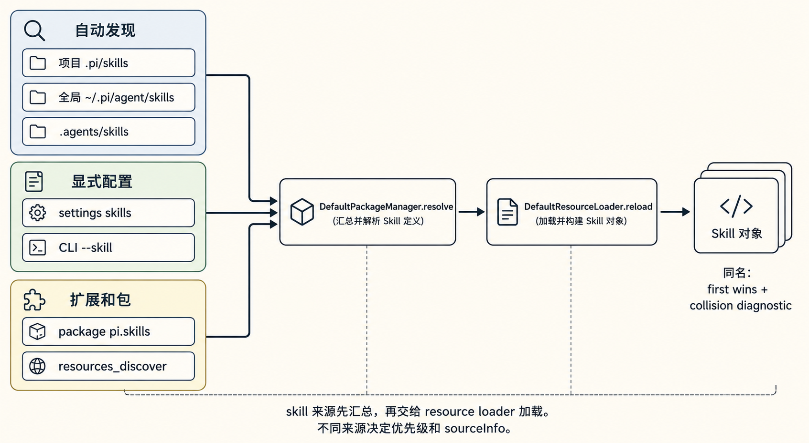
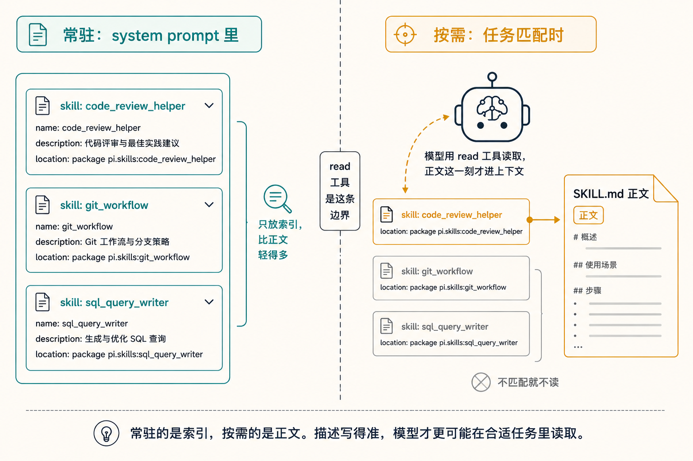
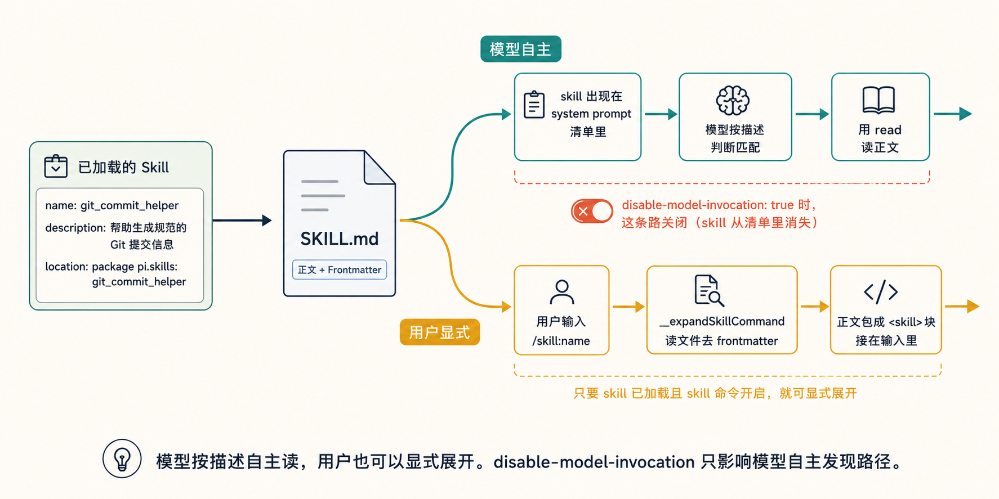
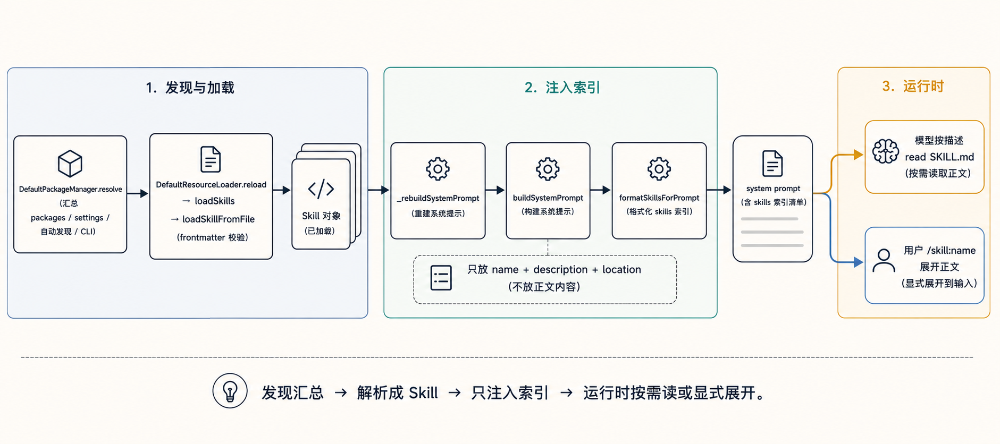
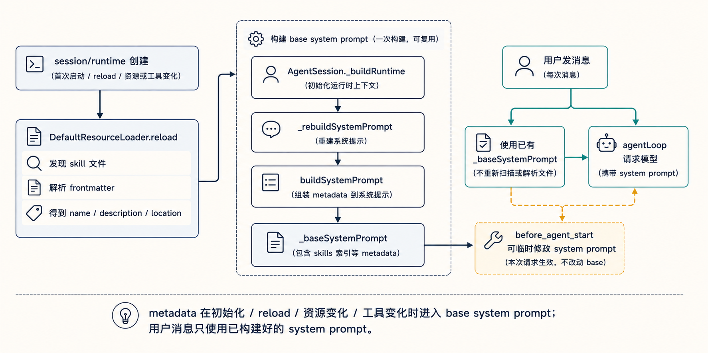
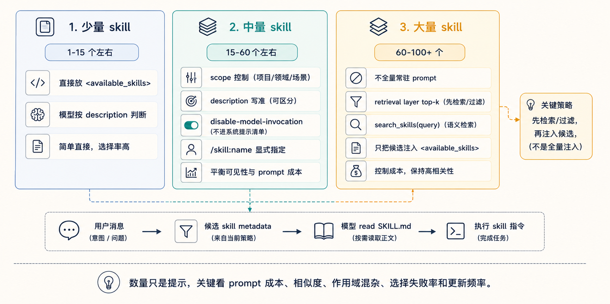

# Pi 系列 09｜Skills 系统：把可复用指令做成按需内容

本系列其他文章：
placeholder

关于 skill 的，前面我也写过两篇，一篇是skill的介绍，一篇是skill的整体格式要求：


> 本文主要参考 `packages/coding-agent/src/core/skills.ts`、`package-manager.ts`、`resource-loader.ts`、`system-prompt.ts`、`agent-session.ts` 和 `docs/skills.md`。

前面几篇讲的是 agent 的运行机制。讨论 skill 时，问题转为另一类：一段可复用的工作方法，怎样交给 agent 使用，又怎样避免长期占用上下文。

skill 可以很长，也可以带脚本、参考资料和示例。一个用户或项目里可能有多份 skill。pi 的处理方式是：启动时只把 skill 的名字、描述和文件位置放进 system prompt；正文留在文件里，任务匹配时再读。用户也可以用 `/skill:name` 把某份 skill 显式展开到本轮输入里。

这篇文章按四个问题展开：skill 文件是什么，pi 从哪里发现它，怎么把它交给模型，显式调用和工具权限的边界在哪里。

## 一、skill 文件是什么

常见的 skill 是一个目录，目录里有 `SKILL.md`：

```text
my-skill/
  SKILL.md
  scripts/
  references/
  assets/
```

`SKILL.md` 头部是 YAML frontmatter，正文是给模型看的使用说明。当前 coding-agent 实现读取的 frontmatter 字段主要是这几个：

```ts
interface SkillFrontmatter {
  name?: string;
  description?: string;
  "disable-model-invocation"?: boolean;
  [key: string]: unknown;
}
```

解析后会得到一个 `Skill` 对象，里面有 `name`、`description`、`filePath`、`baseDir`、`sourceInfo` 和 `disableModelInvocation`。

这里有几处细节需要注意：

- `description` 要有内容。空描述的 skill 会被跳过。
- `name` 可以缺省。缺省时用父目录名作为默认值。
- 名字和描述会做校验，例如名字长度、字符范围、首尾连字符等；多数问题只产生 warning，加载会继续。
- docs 里提到过 `allowed-tools`，当前源码没有把它接到工具准入逻辑里。工具能不能用，仍看 session 的工具注册、allowlist 和 active tools。

这说明 pi 对 skill 文件的校验相对宽松。真正决定一份 skill 能否进入索引的字段，是描述。

## 二、pi 从哪里发现 skill

从源码看，skill 来源不是简单的 user、project、path 三类。当前 coding-agent 会先由 `DefaultPackageManager` 汇总多种来源，再交给 `DefaultResourceLoader` 加载。

主要来源包括：

| 来源 | 行为 |
|---|---|
| 项目 `.pi/skills/` | 自动发现，支持根目录 `.md` 和递归 `SKILL.md` |
| 全局 `~/.pi/agent/skills/` | 自动发现，规则同 `.pi/skills/` |
| 项目 `.agents/skills/` | 从 cwd 往祖先目录找，直到 git 根或文件系统根；只找递归 `SKILL.md` |
| 全局 `~/.agents/skills/` | 兼容其他 harness；只找递归 `SKILL.md` |
| settings / CLI | `settings.json` 的 `skills` 和 `--skill <path>`，可以指文件或目录 |
| packages | npm、git、local package 的 `skills/` 或 `pi.skills` manifest |
| extension | `resources_discover` 事件可以返回额外 skill 路径 |

`--no-skills` 或 SDK 里的 `noSkills` 会关掉默认和自动发现路径。显式给出的路径仍可以加载，例如 CLI 传入的 `--skill` 或 SDK 追加的路径。这能让“默认不扫描”和“明确使用某一份 skill”同时成立。

同名 skill 的处理也要注意：第一个加载到的 skill 保留，后面的同名项产生 collision diagnostic。package-manager 会先按来源优先级排序，项目配置和项目自动发现靠前，用户级资源随后，package 资源更靠后。



## 三、目录扫描规则

目录扫描的核心逻辑在 `loadSkillsFromDirInternal`。

规则可以概括为四条：

1. 当前目录如果有 `SKILL.md`，这个目录就是一份 skill 的根目录，加载后停止继续递归。
2. 如果当前目录没有 `SKILL.md`，且处在允许根目录直接文件的模式，就加载直接子级 `.md` 文件。
3. 继续递归子目录寻找 `SKILL.md`。
4. 跳过点目录、`node_modules`，并读取 `.gitignore`、`.ignore`、`.fdignore`。

第一条需要注意。一份 skill 可以带自己的 `scripts/`、`references/`、`assets/`。根目录出现 `SKILL.md` 后，子目录里的 Markdown 不会被误当成另一份 skill。

`.pi/skills` 和 `~/.pi/agent/skills` 使用 pi 模式，根目录 `.md` 可以作为 skill。`.agents/skills` 使用 agents 模式，根目录 `.md` 不加载，只找 `SKILL.md`。这处差异来自兼容不同 harness 的目录约定。

## 四、交给模型的只有索引

`buildSystemPrompt` 拼 system prompt 时，会检查当前工具列表里有没有 `read`。有 `read` 时，才会追加 skill 清单。原因是：正文要靠文件读取工具拿到；没有 `read`，给模型文件路径也没有执行路径。

`formatSkillsForPrompt` 会过滤掉 `disable-model-invocation: true` 的 skill，然后生成一段 XML 清单，大致是：

```text
The following skills provide specialized instructions for specific tasks.
Use the read tool to load a skill's file when the task matches its description.
When a skill file references a relative path, resolve it against the skill directory ...

<available_skills>
  <skill>
    <name>...</name>
    <description>...</description>
    <location>/absolute/path/SKILL.md</location>
  </skill>
</available_skills>
```

这段清单只承担索引作用：

- `name` 用来标识 skill。
- `description` 用来说明什么时候适合用。
- `location` 给出 `SKILL.md` 的完整文件路径。
- 额外提示说明相对路径要按 skill 目录解析。

正文留在文件里。模型看到清单后，如果当前任务和某个描述匹配，再用 `read` 读取对应文件。这样可以让多份 skill 同时可见，又不把所有正文长期放进 system prompt。



这套设计依赖 description 的质量。描述过宽，模型容易误用；描述过窄，模型可能错过。写 skill 时，description 应该说明能力范围和触发场景，而不只写一句泛泛的介绍。

## 五、用户显式调用 /skill:name

除了模型按描述自主读取，用户也可以显式调用 skill。

交互界面会把 skill 暴露成 `/skill:<name>`，前提是 `enableSkillCommands` 开启，默认开启。真正执行的代码在 `AgentSession._expandSkillCommand`：

1. 识别 `/skill:name args`。
2. 从已加载 skill 列表里按 name 找文件。
3. 读取 `SKILL.md`，去掉 frontmatter。
4. 把正文包成一个 `<skill>` 块，再把用户参数接在后面。

展开后的形态类似：

```text
<skill name="..." location="...">
References are relative to ...

正文
</skill>

用户附加参数
```

`disable-model-invocation` 的作用也在这里体现。它会让 skill 从 system prompt 清单里消失，模型无法通过描述自主发现；用户仍可以用 `/skill:name` 展开。这适合只希望在明确场景中使用的 skill。

`packages/agent` 的 harness 层也有同类能力：`formatSkillInvocation` 和 `AgentHarness.skill()` 会直接把某份 skill 包成输入。coding-agent 只是把这件事接到了 slash command 和交互补全上。



## 六、边界

skill 系统处理的是发现、索引和按需加载。需要区分这些边界：

- 模型看到了 skill 清单，也可能没有读取对应文件。如果需要明确使用某个 skill，可以用 `/skill:name`。
- skill 里的脚本和资料只是说明资源。实际执行仍要经过模型调用工具。
- `allowed-tools` 当前没有形成权限边界。
- skill 内容来自本地文件或包，使用前应审阅来源。它可以指导模型执行有副作用的命令。

## 七、完整链路

把上面的过程串起来：

```text
DefaultPackageManager.resolve()
  -> 汇总 packages / settings / 自动发现 / CLI 资源
DefaultResourceLoader.reload()
  -> loadSkills(skillPaths, includeDefaults=false)
  -> loadSkillFromFile(frontmatter 校验 + SourceInfo)
AgentSession._rebuildSystemPrompt()
  -> buildSystemPrompt(... skills ...)
  -> formatSkillsForPrompt(name + description + location)
运行时
  -> 模型按描述 read SKILL.md
  -> 用户 /skill:name 强制展开正文
```

skill 系统的价值在于把可复用指令整理成可发现的资源。常驻上下文里只放索引，细节留在文件里；需要时再读，用户也可以显式指定。这种拆法让 agent 可以带着一组可复用工作方法运行，同时把上下文成本控制在可管理范围内。




## Q & A

下面我整理了两个问题，作为扩展

> Q：skill metadata 什么时候会被加载进 system prompt，是用户发消息时吗

不是在用户每次发消息时才加载 skill metadata。

更准确地说：

1. 启动/创建 session runtime 时，先创建 `DefaultResourceLoader` 并执行 `resourceLoader.reload()`，这一步会发现并解析 skills metadata：`name`、`description`、`filePath`、`disable-model-invocation` 等。见 [packages/coding-agent/src/core/agent-session-services.ts](packages/coding-agent/src/core/agent-session-services.ts#L137-L143) 和 [packages/coding-agent/src/core/resource-loader.ts](packages/coding-agent/src/core/resource-loader.ts#L320-L390)。

2. 构造 `AgentSession` 时会 `_buildRuntime()`，里面最终 `_rebuildSystemPrompt()`，从 `resourceLoader.getSkills().skills` 取出已加载的 skills，然后调用 `buildSystemPrompt()` 拼进 base system prompt。见 [packages/coding-agent/src/core/agent-session.ts](packages/coding-agent/src/core/agent-session.ts#L855-L888)。

3. 用户发消息时，通常不会重新扫描 skill 文件；`prompt()` 只是把当前 `_baseSystemPrompt` 应用到本轮，除非 extension 的 `before_agent_start` 修改 system prompt。然后底层 `agentLoop` 在真正请求模型前，把 `context.systemPrompt` 放进 LLM context。见 [packages/coding-agent/src/core/agent-session.ts](packages/coding-agent/src/core/agent-session.ts#L1031-L1088) 和 [packages/agent/src/agent-loop.ts](packages/agent/src/agent-loop.ts#L288-L302)。

另外，system prompt 里放的不是 skill 全文，而是可见 skill 的索引块：`name`、`description`、`location`。全文只有两种常见路径会进上下文：模型看到 location 后用 `read` 工具读取，或者用户显式输入 `/skill:name ...`，这会把 skill 文件内容展开成用户消息块。相关格式在 [packages/coding-agent/src/core/skills.ts](packages/coding-agent/src/core/skills.ts#L336-L367)，显式 `/skill:` 展开在 [packages/coding-agent/src/core/agent-session.ts](packages/coding-agent/src/core/agent-session.ts#L1118-L1155)。

简要说：skill metadata 在 session 初始化、reload、资源扩展，或工具集变化导致重建 system prompt 时加载并拼入；用户发消息时，只是使用已经构建好的 system prompt 发送给模型。



> Q：如果 skill 很多，怎么找到需要的 skill

短答案：**skill 数量增多后，不能只靠 system prompt 里的一长串 `<available_skills>` 让模型直接选择**。那只是最基础的索引方式，适合几十个以内；再多就会遇到：

- prompt 变长，常驻成本上升。
- 多个 description 相似，模型容易选错。
- 任务描述不够明确时，模型可能漏选。
- 新增/修改 skill 后，如果没有 reload 或重建 system prompt，当前会话不一定看到。

可以按规模分三层处理。数量只是粗略提示，更重要的是看模型能否稳定地从清单里选对：

| 层级 | 粗略数量 | 更重要的判断标准 |
|---|---:|---|
| 少量 skill | 1-15 个左右 | skill 之间边界清楚，description 不相似，模型基本能直接选对 |
| 中量 skill | 15-60 个左右 | 清单还能放进 prompt，但开始出现相似 skill、跨项目无关 skill、低频流程 skill |
| 大量 skill | 60-100+ 个 | 清单占用较多上下文，模型选择不稳定，很多 skill 与当前任务无关，需要先检索/过滤 |

更实用的划分方式是看这些信号：

1. **看 prompt 成本**

  如果 `<available_skills>` 已经占了明显上下文，或者每轮都带着很多当前任务用不上的 metadata，就进入中量/大量问题了。

2. **看相似度**

  数量不多但 description 很像，也应该按中量处理。比如：

  - `release-checklist`
  - `release-notes`
  - `release-versioning`
  - `release-publish`

  这类 skill 只有十几个，也可能让模型选错。

3. **看作用域混杂程度**

  如果全局 skill、项目 skill、package skill、extension skill 混在一起，当前项目只会用其中一部分，就不能只看总数。即使 30 个也应该做 scope 控制。

4. **看选择失败率**

  如果经常出现这些情况，就说明已经超过“少量”：

  - 模型没有读应该读的 skill。
  - 模型读了不相关的 skill。
  - 用户经常需要纠正“不是这个 skill”。
  - 你开始依赖 `/skill:name` 才能保证正确。

5. **看更新频率**

  如果 skill 经常新增、删除、改名，或者来自 extension/package 动态发现，就更适合 retrieval 或 `search_skills`，因为静态 system prompt 清单容易过期。

**第一层：少量 skill**

少量 skill 时，当前 pi 的基础机制通常就够用：启动/reload 时加载所有可见 skill metadata，然后把 `name + description + location` 放进 system prompt。模型看到清单后，按 description 判断是否需要 `read` 对应的 `SKILL.md`。

这一层的重点是：

- skill 数量少，prompt 成本可控。
- 每个 skill 的 description 写清楚即可。
- 用户知道要用哪份时，仍然可以用 `/skill:name` 显式指定。

**第二层：中量 skill**

中量 skill 的意思是：数量已经多到会出现干扰，但还没有多到必须上检索系统。这个阶段的目标不是“搜索所有 skill”，而是先管理好哪些 skill 会被模型看到、什么时候被看到、用户如何显式指定。

要提高命中率，现在能做的是：

1. **控制可见范围**

  不要把所有全局 skill 都默认暴露给每个项目。项目 `.pi/skills` 放项目相关的，全局 skill 放真正通用的。避免把大量领域无关的 skill 放在全局目录。

2. **写好 `description`**

   description 不是介绍文案，而是检索触发条件。应该写：

   ```text
   Use when analyzing pi agent session lifecycle, resource loading, or system prompt construction.
   ```

   而不是：

   ```text
   Helps understand pi.
   ```

    `description` 应包含领域、任务、触发词和边界。必要时也可以说明不适用场景。

3. **用 `disable-model-invocation` 管理低频 skill**

  有些 skill 不适合让模型自主发现，比如危险操作、少见流程、非常具体的发布流程。可以设 `disable-model-invocation: true`，让它不出现在 system prompt，只能由用户通过 `/skill:name` 显式调用。

4. **命名要可搜索**

  `skill name` 应该像命令名，而不是文章标题。例如：

   ```text
   agent-session-lifecycle
   skill-system-analysis
   release-checklist
   provider-integration
   ```

    这样用户用 `/skill:` 补全或搜索时更容易找到。

5. **保留显式调用路径**

  如果用户知道要用哪份 skill，可以直接 `/skill:name`。模型自主选择适合“用户不确定是否需要 skill”的情况；用户显式指定适合“已经明确要按某套流程执行”的情况。

这一层可以理解成：先通过 scope 减少无关 skill，通过 description 提高模型判断质量，通过 `disable-model-invocation` 隐藏不适合自主触发的 skill，再用 `/skill:name` 作为人工明确指定的路径。

**第三层：大量 skill**

大量 skill 的意思是：skill 已经多到不适合全部放进 `<available_skills>`。这时继续扩大 system prompt 清单会降低选择稳定性，也会增加每轮请求的固定上下文成本。

大量 skill 有两种更合适的做法。

**做法 A：skill retrieval layer**

这是“模型请求前”的自动检索层。它不让模型先阅读完整 skill 清单，而是在构造本轮上下文前，先由 harness 根据用户消息和运行环境筛出少量候选。

流程可以是：

```text
User message
  -> skill retriever
       - BM25 / embedding / tag filter
       - 根据 cwd、package、语言、任务类型过滤
       - 返回 top-k skill metadata
  -> system prompt 只注入 top-k candidates
  -> 模型决定 read 哪个 SKILL.md
```

这一层可以包含几项工作：

- 建索引：把 skill 的 `name`、`description`、`location`、`sourceInfo`、可选 tags、可选正文摘要放进索引。
- 取查询：用用户最新消息、最近几轮上下文、cwd、当前 package、文件语言、命令来源构造 query。
- 先过滤：按项目/全局 scope、package、语言、任务类型、`disable-model-invocation` 做硬过滤。
- 再排序：用 BM25、embedding similarity、关键词命中、来源优先级、最近使用记录综合打分。
- 控制数量：只返回 top-k，比如 3 到 8 个，避免候选列表过大。
- 提供匹配理由：每个候选最好带 `score` 和 `reason`，让模型知道为什么它被选出来。

它的优点：

- 不需要把所有 skill metadata 常驻进 system prompt。
- 候选更贴近当前项目和当前任务。
- 选择发生在模型外部，更容易测试和调参。
- 可以缓存索引，只在 reload、skill 文件变化或配置变化时更新。

它的风险：

- retriever 如果召回失败，模型可能无法看到正确 skill。
- scoring 规则会影响模型行为，需要观察误召回和漏召回。
- top-k 太小会漏，太大又会重新引入 prompt 过大的问题。

所以 retrieval layer 适合做默认路径，但最好保留 `/skill:name` 和 `search_skills` 作为备用路径。

**做法 B：`search_skills(query)` 工具**

这是“模型请求中”的主动搜索工具。system prompt 不再列几百个 skill，只告诉模型：需要专门流程时，可以先调用 `search_skills` 找候选。

工具返回可以是：

```text
search_skills(query) -> [{ name, description, location, score }]
```

更完整的结果可以包含：

- `name`：用于用户或模型识别 skill。
- `description`：用于判断是否匹配当前任务。
- `location`：给模型后续用 `read` 读取 `SKILL.md`。
- `score`：检索分数。
- `reason`：为什么命中，比如关键词、tag、项目 scope、最近使用。
- `sourceInfo`：来自项目、用户全局、package 还是 extension。

运行流程是：

```text
User message
  -> model sees: use search_skills when specialized instructions may help
  -> model calls search_skills("...")
  -> tool returns candidate skills
  -> model chooses one or more locations
  -> model uses read to load SKILL.md
  -> model follows the skill content
```

它的优点：

- system prompt 更小，不需要常驻大清单。
- 模型可以按自己的理解改写 query，必要时多搜一次。
- 对开放问题更适合，比如用户只说“帮我处理发布流程”。
- skill 集合很动态时，工具可以实时查最新索引。

它的风险：

- 多一次模型-工具往返，延迟和后续上下文 token 成本会增加。
- 模型可能没有触发搜索，所以 system prompt 要明确什么时候调用。
- 工具结果必须短，不应把 skill 正文直接返回；正文仍应由 `read` 按需读取。
- 查询词如果过于宽泛，需要工具支持 tag/filter 或返回可解释 reason。

两个方案可以组合：

- 默认先用 retrieval layer 自动注入 top-k。
- 如果自动候选不足，模型再调用 `search_skills(query)`。
- 用户明确知道要用哪份时，仍然直接 `/skill:name`。
- 执行顺序是：自动召回优先，模型主动搜索作为补充，用户显式指定作为最后的明确选择。

所以总结一下：**少量 skill 靠 system prompt 索引；中量 skill 靠 scope、description、disable-model-invocation 和 `/skill:name` 管理可见性；大量 skill 才进入 retrieval layer 或 `search_skills(query)`，只给模型本轮相关的候选。**



好了，本篇结束