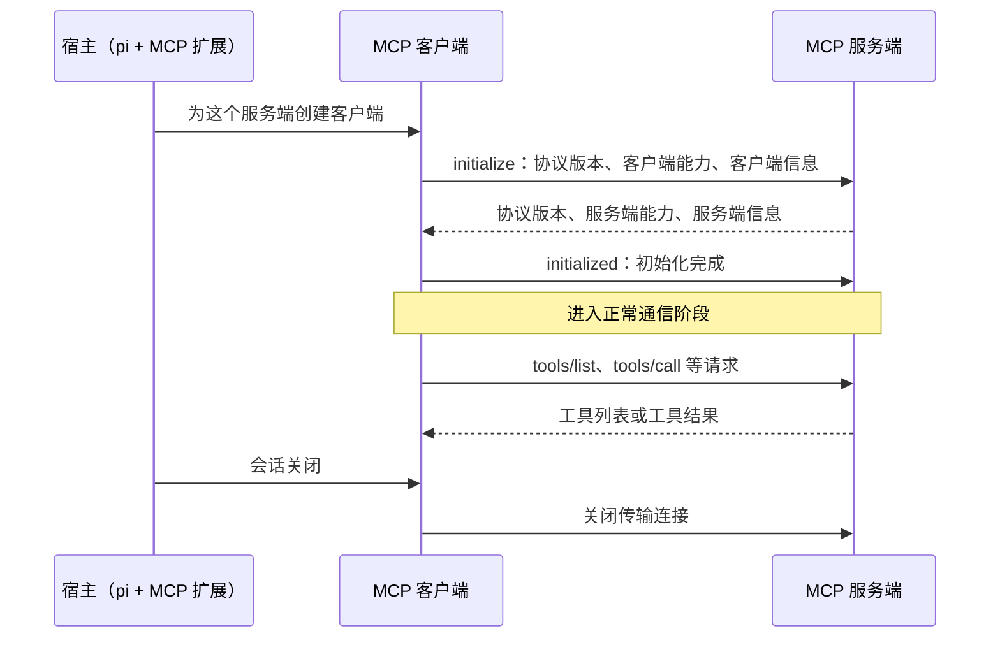
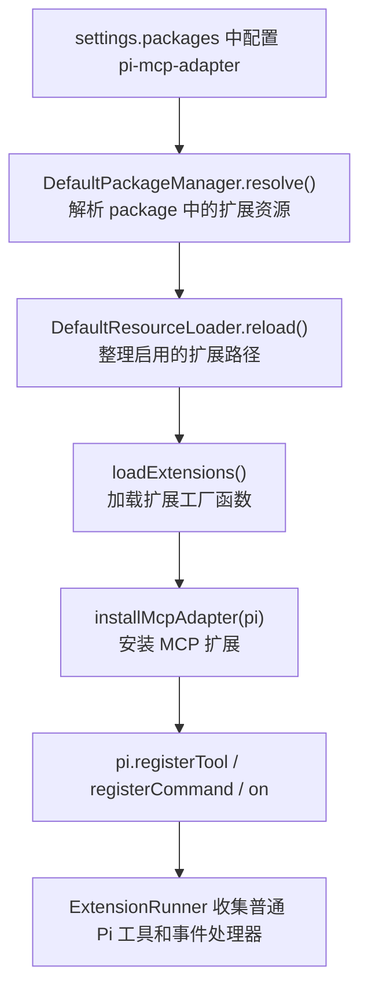
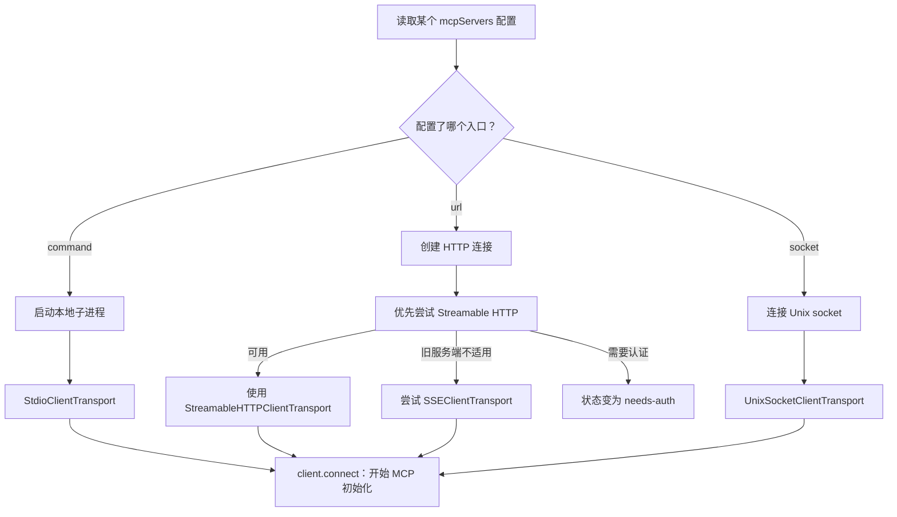
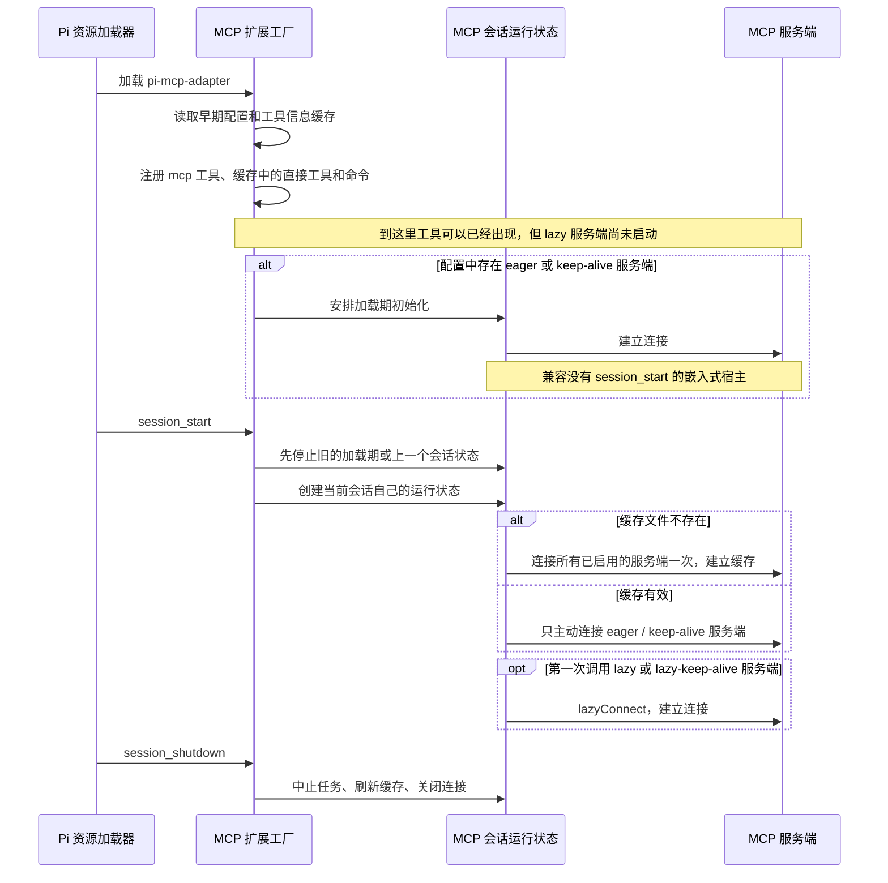
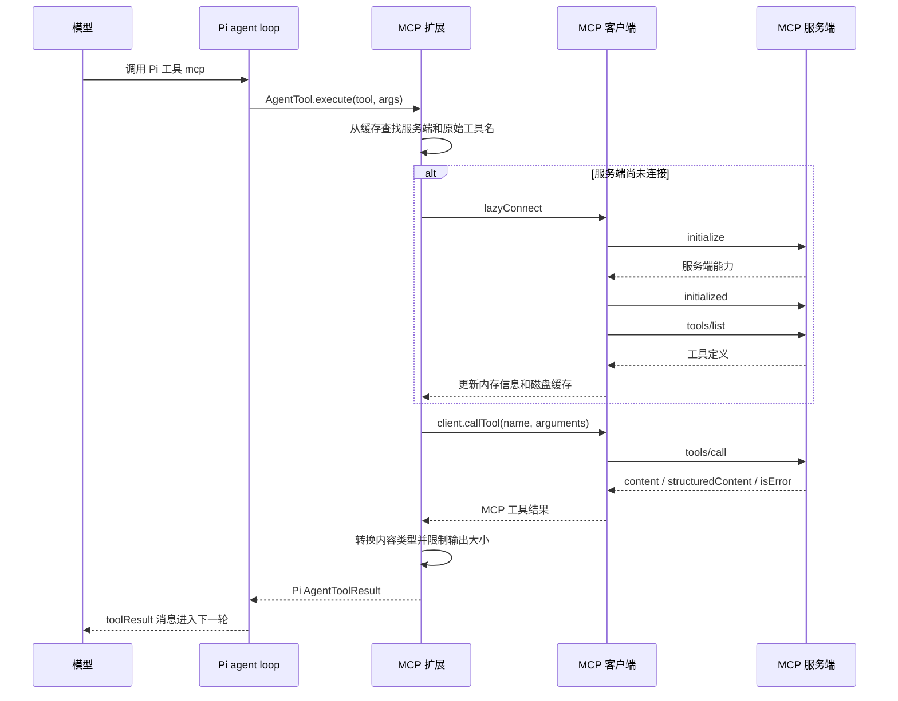
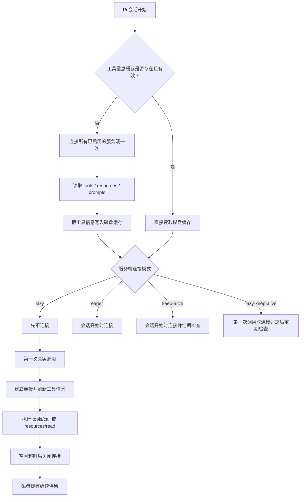
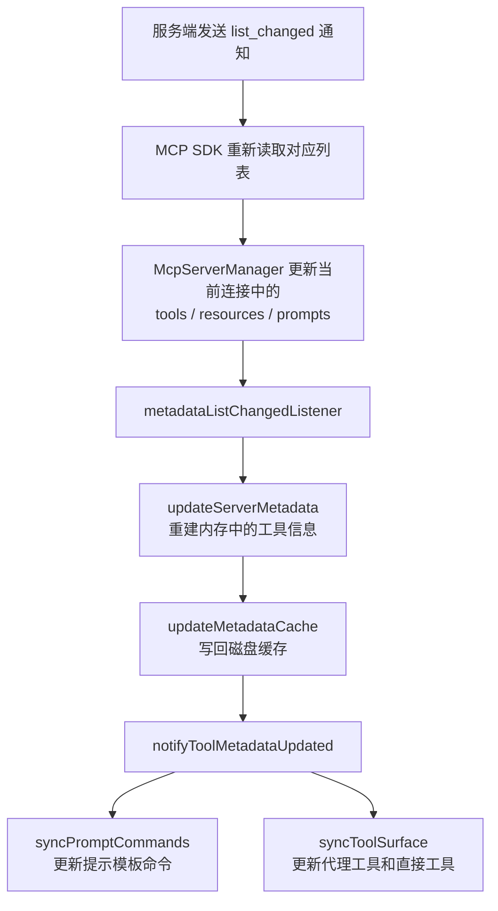
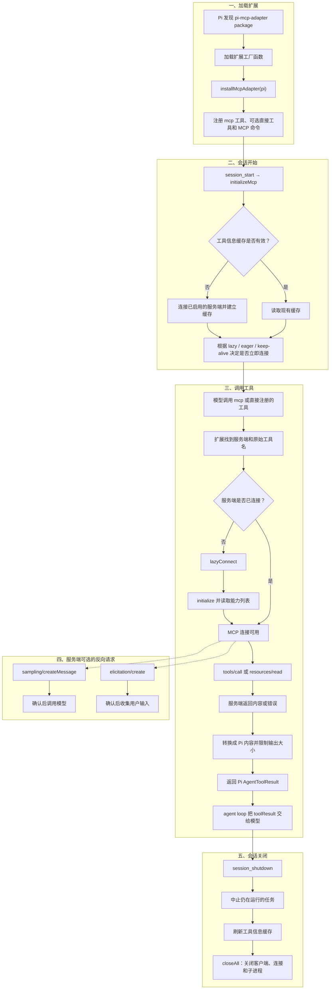

# 13 MCP 接入 · 学习笔记

> 核心问题：pi 为什么不内置 MCP？通过扩展接入后，MCP 的工具、资源和提示模板怎样进入 pi？服务端反向发起的模型调用和用户输入请求怎样处理？扩展又怎样控制上下文、连接和结果大小？
> 证据来源：pi 的 `packages/coding-agent/README.md`、`resource-loader.ts`、`extensions/runner.ts`；`pi-mcp-adapter@2.15.0` 的 `index.ts`、`init.ts`、`server-manager.ts`、`direct-tools.ts`、`proxy-modes.ts`、`tool-registrar.ts`、`metadata-cache.ts`、`lifecycle.ts`、`mcp-output-guard.ts`、`sampling-handler.ts`、`elicitation-handler.ts`；MCP 2025-06-18 specification 的 architecture、lifecycle、tools、resources、prompts、sampling、elicitation；Mario Zechner 的 *What if you don't need MCP at all?*。
> 一句话：pi 核心不处理 MCP，只负责加载扩展和执行普通 Pi 工具。MCP 扩展负责连接服务端，把远端能力转换成 Pi 工具和命令，并处理服务端反向发起的模型调用与用户输入请求。
> 证据边界：协议角色、消息和能力来自 MCP specification；pi 的加载方式和 adapter 行为来自对应版本源码；工具暴露方式、CLI/MCP 选择和安全建议是基于这些事实做出的工程判断，不是源码强制规则。

---

## 先确定边界：MCP 规定协议，应用决定接入方式

MCP 解决的是互操作问题：应用不必为每个外部系统分别设计连接、发现和调用协议，服务端可以按统一方式提供工具、资源和提示模板。

但协议不会替应用做这些决定：

- 大量远端工具是否都要放进模型上下文。
- 服务端在启动时连接，还是第一次使用时连接。
- 工具调用前是否需要用户确认。
- 过大的结果是原样进入上下文，还是截断并保存到文件。
- 多个服务端的同名工具怎样命名和区分。
- 资源和提示模板应转换成工具、命令还是界面入口。

这些都由应用决定，不是 MCP 消息格式能够决定的。

pi 的选择很明确：核心代码不内置 MCP。`packages/coding-agent/README.md` 建议优先使用 CLI 配合 README 或 skill；确实需要 MCP 服务时，再通过扩展接入。因此“不默认提供 MCP”和“不能使用 MCP”是两回事。

---

## 阅读前先记住这些词

下面只保留源码和规范中确实会出现的英文名称。先记住中文含义，后面再看到英文时就不容易混乱。

| 名称 | 中文理解 | 在本文中的例子 |
|---|---|---|
| Host | 宿主应用，负责管理模型、权限、界面和多个连接 | pi 加上 MCP 扩展 |
| Client | MCP 客户端，负责和一个服务端通信 | `McpServerManager` 创建的 `Client` |
| Server | MCP 服务端，真正提供工具或数据 | 本地 stdio 子进程、HTTP 服务 |
| Capability | 双方在初始化时声明的“我支持什么” | tools、resources、sampling |
| Transport | 消息通过什么通道传输 | stdio、Streamable HTTP、旧版 SSE、Unix socket |
| Metadata | 工具的名称、说明、参数结构等信息 | `tools/list` 返回的定义 |
| Cache | 保存到磁盘的工具信息，下次可以先读取它 | `mcp-cache.json` |
| Proxy tool | 一个统一入口，先搜索再调用远端工具 | Pi 中的 `mcp` 工具 |
| Direct tool | 直接注册到 Pi 工具列表中的 MCP 工具 | `directTools` 配置产生的工具 |

后文出现“扩展”时，主要指 `pi-mcp-adapter`；出现“核心代码”时，主要指 pi 原有的 package 加载、agent loop 和工具执行代码。

### 这份笔记覆盖哪些机制

| 你可能会问的问题 | 对应位置 |
|---|---|
| MCP 中宿主、客户端、服务端分别是谁？ | 第一节 |
| tools、resources、prompts、sampling、elicitation 有什么差别？ | 第二节 |
| pi 怎样发现并加载 MCP 扩展？ | 第三节“pi 核心只看见 package、扩展和普通工具” |
| 配置从哪里来，stdio、Streamable HTTP、SSE、Unix socket 怎样选择？ | 第三节“配置决定使用哪种连接方式” |
| 扩展什么时候加载，服务端什么时候真正启动？ | 第三节“加载扩展和启动服务端不是同一件事” |
| 为什么模型有时只看到一个 `mcp` 工具？ | 第四节 |
| 一次工具调用怎样进入服务端再回到模型？ | 第五节 |
| 缓存、按需连接、空闲关闭和自动重连怎样配合？ | 第六节 |
| MCP 结果怎样转换、截断和落盘？ | 第七节 |
| 为什么 pi 还建议使用命令行工具和 skill？ | 第八节 |
| 安全边界在哪里？ | 第九节 |
| 应该按什么顺序读源码？ | 第十节 |
| 怎样做一个最小实验验证结论？ | 第十一节 |
| 如何从加载一路看到会话关闭？ | 文末“核心链路”总图 |

---

## 一、先把 MCP 的三层角色分清

官方架构有三个角色：

| 角色 | 在 pi 接入中的对应物 | 责任 |
|---|---|---|
| Host（宿主） | pi + `pi-mcp-adapter` 扩展 | 管理多个客户端、权限、连接生命周期、上下文和用户交互 |
| Client（客户端） | `McpServerManager` 为每个服务端创建的 `Client` | 与一个服务端建立会话，协商能力，发送请求，接收通知 |
| Server（服务端） | stdio 子进程、HTTP 地址或 Unix socket 后的 MCP 服务 | 提供工具、资源和提示模板等能力 |

一个宿主可以管理多个客户端，但一个客户端只连接一个服务端。`McpServerManager.connections` 以服务端名称为 key；每个连接都有自己的 `Client`、传输通道、工具信息、连接状态和正在执行的请求数量。

下面这张图先只看一个客户端和一个服务端。连接建立后，必须先初始化，不能一上来就调用工具。



初始化阶段会交换双方支持的能力。后续只能使用已经声明的能力，例如 `tools`、`resources`、`prompts`、`sampling`、`elicitation`。因此，扩展读取资源和提示模板前会先检查服务端是否声明支持；工具列表则在连接成功后读取，并处理分页结果。

---

## 二、MCP 的能力不只是一组工具

### Tools：由模型调用

服务端通过 `tools/list` 返回工具的 `name`、`description`、`inputSchema` 等定义。宿主从中选择要交给模型的工具；模型决定调用后，客户端发送 `tools/call`。如果工具列表发生变化，服务端可以发送 `notifications/tools/list_changed` 通知客户端重新读取。

工具结果可以包含文本、图片、音频、资源链接、内嵌资源，也可以带 `structuredContent` 和 `isError`。要区分两种错误：JSON-RPC error 表示请求本身失败；`isError: true` 表示工具请求已经被服务端处理，但业务执行失败。

### Resources：由应用决定怎样使用

资源通过 URI 标识。客户端可以用 `resources/list` 列出资源，用 `resources/read` 读取内容。协议还支持资源模板、订阅和列表变化通知。资源怎样展示或进入模型上下文，由宿主决定，可以通过界面选择、搜索或规则自动加入。

`pi-mcp-adapter@2.15.0` 选择把已发现的资源转换成 `read_<resource>` 形式的 Pi 工具。模型调用它时，扩展执行 `readResource({ uri })`，而不是 `callTool`。这是 adapter 的实现选择，不是 MCP 协议的强制要求。

### Prompts：由用户主动选择

服务端用 `prompts/list` 返回提示模板，用 `prompts/get` 根据参数生成消息。规范建议由用户主动选择提示模板。adapter 将缓存的模板注册成 `/mcp__<server>__<prompt>` 命令，而不是注册成模型可以自行调用的工具。

### Sampling 和 Elicitation：服务端反向请求应用

前面三类能力主要由客户端向服务端发请求。MCP 还允许服务端向客户端发起请求，`pi-mcp-adapter` 实现了其中两类：

- `sampling/createMessage`：服务端请求宿主调用模型。adapter 会依次考虑服务端给出的模型偏好、当前模型和其它可用模型，选择一个已经配置凭据的模型，再调用 pi-ai 的 `complete()`。默认在调用模型前确认一次，在把模型结果返回服务端前再确认一次。没有交互界面时，只有明确配置 `samplingAutoApprove` 才会开放这项能力。
- `elicitation/create`：服务端请求用户填写表单或打开网页。adapter 用 Pi 的 `select()` / `input()` 收集并校验字段，提交前显示汇总。用户可以接受、拒绝或取消。打开网页的模式只在 TUI 中声明，而且打开浏览器前必须确认。

这两类能力只在条件满足时才会由客户端声明。sampling 当前只支持文本消息，不支持附带上下文、工具、停止序列、音频或图片；elicitation 需要 Pi 提供交互界面。adapter 没有声明的能力，服务端不能直接使用。

版本边界也要写清楚：`pi-mcp-adapter@2.15.0` 的 `buildClientCapabilities()` 只组装 sampling 和 elicitation，尚未提供 roots。不能把 MCP specification 中存在的客户端能力，直接当成当前 adapter 都已实现。

因此 MCP 不是单向的“远端工具列表”。客户端既会调用服务端，服务端也可能请求宿主使用模型或与用户交互。宿主必须控制这类反向请求的能力声明和确认流程。

---

## 三、pi 核心只看见 package、扩展和普通工具

安装 `pi-mcp-adapter` 后，pi 的加载链没有 MCP 特例：



`DefaultResourceLoader.reload()` 先解析 package 中的资源，再调用 `loadExtensions()`。`ExtensionRunner.getAllRegisteredTools()` 只遍历每个扩展注册的工具。对 runner 来说，`mcp`、`github_search_repositories` 和其它扩展工具没有区别。

这条边界很重要：

- pi 核心不负责 MCP 的传输连接、OAuth、能力协商或列表变化通知。
- adapter 不需要修改 agent loop，只要实现 Pi `AgentTool` 的 `execute` 接口。
- MCP 工具结果转换成 Pi `AgentToolResult` 后，事件发送、消息保存和下一轮模型调用继续使用普通工具链路。
- adapter 可以单独升级、替换或禁用，不需要把 MCP 代码写进 pi 核心。

因此，MCP 接入首先依赖 pi 已有的扩展接口，不需要在 agent loop 中增加一条专用执行链。

### 配置决定使用哪种连接方式

扩展加载完成后，会读取 MCP 配置来确定有哪些服务端，以及每个服务端怎样连接。项目通常把共享配置放在 `.mcp.json`，只给 pi 使用的项目覆盖项放在 `.pi/mcp.json`。扩展也会读取用户全局配置；同名服务端在后读取的配置中出现时，会覆盖前面的定义。

每个服务端必须且只能选择下面一种入口：

| 配置字段 | 实际连接方式 | 适合的场景 |
|---|---|---|
| `command` | `StdioClientTransport`，启动本地子进程，通过标准输入输出通信 | 本地 MCP 服务端 |
| `url` | 先尝试 `StreamableHTTPClientTransport`；不适用时再尝试旧版 `SSEClientTransport` | 远端或常驻 HTTP 服务 |
| `socket` | `UnixSocketClientTransport` | 本机已有 Unix socket 服务 |

`Streamable HTTP` 不是第四个配置字段。它是配置 `url` 后优先采用的 MCP HTTP transport；SSE 是兼容旧服务端的后备方式。认证失败和用户取消不是“服务端不支持 Streamable HTTP”的证据，adapter 不应把这两类情况当成普通 transport 降级。



三个字段不能同时配置。`McpServerManager.createConnection()` 会统计 `command`、`url`、`socket` 中有值的字段，数量不是 1 就直接报错。

远端 HTTP 服务可以使用 bearer token 或 OAuth。HTTP 返回未授权错误且该服务支持 OAuth 时，连接状态会变成 `needs-auth`，等待用户完成认证。`pi-mcp-adapter@2.15.0` 将持久化 OAuth 凭据写入操作系统安全凭据库；旧版本留下的明文 token 文件只用于迁移，成功导入后会被删除。

### “加载扩展”和“启动服务端”不是同一件事

MCP 接入中有几个不同的时点。把它们分开，才能理解为什么有时工具已经出现在列表里，但服务端进程还没有运行。



按源码顺序看，这几个时点分别发生了什么：

1. **扩展工厂加载时**：`installMcpAdapter()` 读取 `earlyConfig` 和 `earlyCache`，注册缓存中的 MCP prompt 命令，调用 `syncDirectTools()` 和 `syncProxyTool()`。这一步主要建立 Pi 侧的工具表面，不等于服务端已经连接。
2. **加载期初始化**：`startLoadTimeInitialization()` 只在配置中存在 `eager` 或 `keep-alive` 服务端时安排执行。它主要兼容那些加载扩展后不会发送 `session_start` 的 SDK 宿主。
3. **收到 `session_start` 时**：扩展先中止并清理旧的运行状态，再为当前会话创建新的 owner、OAuth runtime 和 `McpExtensionState`。因此，如果加载期初始化已经运行，当前会话的状态会接管它，而不是继续共用旧状态。
4. **`initializeMcp()` 内部**：只有缓存文件不存在时，才会把所有已启用的服务端作为首次建立缓存的对象；缓存存在后，启动阶段只连接 `eager` 和 `keep-alive` 服务端。
5. **第一次真实调用时**：`lazy` 和 `lazy-keep-alive` 通过 `lazyConnect()` 建立连接。对于 `command` 配置，这时才启动 stdio 子进程；对于 `url` 和 `socket`，adapter 连接的是已经存在的服务。
6. **运行期间**：`McpLifecycleManager` 定时检查需要保持连接的服务端，并关闭已经空闲的普通连接。
7. **会话关闭时**：`session_shutdown` 先中止异步任务，再刷新缓存并关闭客户端、传输连接和 adapter 启动的 stdio 子进程。

所以“工具什么时候注册”“客户端什么时候初始化”“服务端什么时候真正连接或启动”是三个不同问题。

---

## 四、扩展有两种工具暴露方式

### 默认：一个代理工具

`installMcpAdapter()` 默认注册一个名为 `mcp` 的 Pi 工具。它可以查看状态、列出服务端、搜索工具、查看参数、主动连接和调用工具。

模型通过代理工具时，通常要走三步：


对应的调用形式是：

```ts
mcp({ search: "screenshot" })
mcp({ describe: "chrome_take_screenshot" })
mcp({ tool: "chrome_take_screenshot", args: { format: "png" } })
```

代价是一次任务可能多一到两个搜索调用；收益是模型开始时只看到一个 `mcp` 工具定义，而不是所有 MCP 工具的名称、说明和参数结构。

### 可选：直接注册工具

`directTools: true | string[]` 会让 adapter 从工具信息缓存中重建 `DirectToolSpec`，再逐个调用 `pi.registerTool`。模型可以像调用 `read`、`bash` 一样直接调用这些工具，不需要先经过 `mcp search`。

转换时主要对应这些字段：

| MCP 工具信息 | Pi 工具定义 |
|---|---|
| 加上服务端前缀的工具名 | `name` |
| 原始工具名 | 显示在 label 中，调用服务端时仍使用这个名称 |
| 工具说明 | `description` / 截断后的 `promptSnippet` |
| `inputSchema` | 标准化后作为 `parameters` |
| `tools/call` | `execute` 内的 `client.callTool` |

直接注册可以省掉搜索步骤，但每个参数结构都会进入模型工具列表。扩展还要处理内置名称冲突、不同服务端的重名、工具过滤、缓存过期和动态列表变化。

### 两种方式可以混合使用

下面是基于上下文占用和调用步骤给出的使用建议，不是 adapter 的强制策略：

- 高频、稳定、数量少的工具直接注册。
- 数量多或很少使用的工具继续通过代理工具查找。
- 用 include/exclude 控制模型实际看见的工具，不把“服务端能提供什么”直接等同于“当前模型应看到什么”。

这与 skill 的按需加载相似：先提供索引和入口，完整参数结构在需要时再读取。

---

## 五、一次代理工具调用的链路

以 `mcp({ tool, args })` 为例：



读这张图时要分清三层：

1. **模型调用的是 Pi 工具**：agent loop 不直接发送 MCP JSON-RPC。
2. **扩展调用 MCP 客户端**：客户端负责初始化、传输和协议消息。
3. **服务端执行实际操作**：扩展不替服务端解释业务参数，也不能保证返回内容一定正确。

直接注册工具只省掉前面的代理搜索。后半段相同：`createDirectToolExecutor` 仍会按需连接、调用 `callTool`、转换结果并限制输出大小。

---

## 六、工具信息和实时连接分别管理

默认 `lazy` 并不等于“什么都没有”。扩展把工具信息和实时连接分开保存：工具信息可以在磁盘缓存中，服务端进程或 HTTP 连接则可以暂时不存在。



这里有一个首次启动例外。`initializeMcp()` 发现缓存文件不存在时会设置 `bootstrapAll = true`，连接所有已启用的服务端一次，用来建立工具信息缓存。缓存存在后，启动时只主动连接 `eager` 和 `keep-alive` 服务端；`lazy` 服务端等到真实调用再连接。

`metadata-cache.ts` 根据服务端配置生成摘要值，并用 7 天最大保存时间判断缓存是否有效。连接方式、空闲时间和调试开关不会改变服务端提供哪些工具，因此不参与这个摘要值的计算。

adapter 支持四种连接方式：

| 模式 | 首次连接 | 空闲关闭 | 断线重连 |
|---|---|---|---|
| `lazy` | 首次使用 | 默认会 | 下次使用 |
| `eager` | 启动时 | 默认不会 | 不自动重连 |
| `keep-alive` | 启动时 | 不会 | 定期检查并自动重连 |
| `lazy-keep-alive` | 首次使用 | 不会 | 首次连接后自动重连 |

`McpLifecycleManager` 每 30 秒检查需要保持连接的服务端，以及已经空闲的服务端。会话关闭时，扩展收到 `session_shutdown`：先中止仍在运行的任务，再刷新工具信息缓存，最后执行 `gracefulShutdown -> manager.closeAll()`。这样既能释放资源，也能避免旧会话的异步任务继续使用已经失效的 `ExtensionContext`。

连接并发也有保护。`McpServerManager.connectPromises` 让同一服务端同时发生的多个连接请求共用一个 Promise；`closeGenerations` 和连接对象身份检查用于防止旧连接稍后关闭时误改新连接的状态。

### 服务端能力变化后怎样刷新

如果服务端在初始化时声明支持列表变化通知，工具、资源或提示模板发生变化后，可以通知客户端重新获取。adapter 的刷新链如下：



这条链说明缓存不是只在启动时写一次。服务端明确通知列表变化时，当前会话中的工具信息和磁盘缓存都会更新。服务端没有声明这项能力时，adapter 不能凭空知道远端列表已经改变，需要通过重新连接等显式操作刷新。

---

## 七、MCP 结果怎样转换成 Pi 结果

`transformMcpContent()` 的映射：

| MCP 内容 | Pi 内容 |
|---|---|
| text | text |
| image | image，保留 base64 数据和 mimeType |
| embedded resource | 带 URI 前缀的文本 |
| resource link | 带名称和 URI 的文本 |
| audio | 一条说明音频类型的文本，不把音频作为 Pi 原生内容 |
| 未识别类型 | 转成 JSON 文本 |

如果 `content` 为空但有 `structuredContent`，adapter 会把它格式化为 JSON 文本。Pi 模型最终看到的是转换后的内容，不一定保留 MCP 结果中的所有原始类型。

错误同样经过翻译：

- `result.isError === true` 会转成带 `details.error = "tool_error"` 的 Pi 工具结果。
- 连接、JSON-RPC、取消、认证和会话失效等异常会转成 adapter 自己的错误分类。
- `tool_result` 扩展事件再通过 `toolErrorOverride` 把 MCP 失败结果标记成 pi 的 `isError`。

扩展还会限制输出大小。默认情况下，文本上限是 50 KiB 或 2,000 行，原始详情上限是 16 KiB。超过限制时只保留开头预览，把完整内容写入权限为 `0600` 的临时文件。图片不会被截断。临时文件不会自动删除，其中可能包含敏感数据。

因此，扩展不只负责转换类型，还要限制进入模型上下文和会话文件的内容大小。

---

## 八、为什么 pi 默认建议命令行工具加 skill

Mario 的论点针对的是常见 MCP 使用方式，不是协议本身：通用服务端为了覆盖很多场景，会提供大量工具。每个工具的名称、说明和参数结构都会占用上下文；接入多个服务端后，这部分内容会继续增加。

命令行工具配合 README 或 skill 的优势：

- 模型已经会 Bash 和代码，接口说明可以很短。
- README 或 skill 可以按需读取，不必在每次会话中一直放着完整定义。
- 命令可以通过管道、文件和脚本组合，中间数据不一定经过模型上下文。
- 输出格式和新命令可以直接按本地任务修改。

但 MCP 仍有明确价值：

- 已有系统只提供 MCP 服务端，没有合适的命令行工具。
- 需要统一的能力发现、参数结构、OAuth、变化通知、资源或提示模板。
- 应用需要用同一套协议连接本地进程和远端服务。
- 用户需要界面、授权和工具列表，而不是自己组合 shell 命令。

下面的选择表是工程建议，不是源码行为：

| 问题 | 更偏命令行工具 + skill | 更偏 MCP |
|---|---|---|
| 是否已有稳定的命令行工具 | 是 | 否，但已有 MCP 服务端 |
| 是否需要在多个应用中复用 | 不重要 | 重要 |
| 是否需要运行时发现工具、资源或提示模板 | 很少需要 | 经常需要 |
| 是否依赖管道、文件和脚本组合结果 | 经常 | 较少，或由应用组织 |
| 是否需要 OAuth、远端连接和变化通知 | 很少 | 经常 |
| 工具很多但每次只用少数 | 用 skill 按需说明 | 用代理工具、过滤和缓存控制列表 |

pi 的 adapter 在两种方式之间做了选择：保留 MCP 协议能力，同时用代理工具、按需连接、缓存和输出限制减少上下文与进程占用。

---

## 九、安全边界

MCP 架构把安全决策放在宿主。服务端不应看到完整对话，也不应看到其它服务端；宿主负责权限、用户确认和上下文组织。

接入 pi 时至少要分六类风险：

1. **安装风险**：pi package 和扩展可以在本机执行任意代码，不是受限的 MCP 客户端。安装 adapter 本身也要检查来源和源码。
2. **服务端启动风险**：stdio 配置会执行本地命令，`npx -y` 还可能下载并运行 package。配置文件实际上包含可执行入口。
3. **远端调用风险**：工具参数可能把本地数据发给服务端。敏感调用应让用户确认、展示参数、记录调用并设置超时。
4. **反向请求风险**：sampling 会消耗模型额度并把结果返回服务端；elicitation 会把用户填写的内容返回服务端。两者都要显示来源并经过确认。
5. **结果风险**：工具结果和附加标记来自服务端，必须视为不可信输入；输出大小限制不会验证事实，也不能消除提示词注入。
6. **凭据风险**：HTTP 请求头、bearer token、OAuth token 和 stdio 环境变量不应进入日志、模型上下文或提交到仓库的配置。

还要注意两个容易误判的点：

- MCP 的客户端/服务端分离不等于进程沙箱。stdio 服务端仍可能拥有当前用户的文件和网络权限。
- 按需连接只减少常驻进程和启动成本，不会减少服务端连接后的权限。
- `pi-mcp-adapter@2.15.0` 会确认 sampling 和 elicitation 反向请求，但普通 proxy/direct 工具调用链中没有统一的“每次调用前确认”步骤。危险工具需要通过工具过滤、额外的 pi 扩展事件或隔离环境限制，不能假设 adapter 会自动弹出确认框。

---

## 十、五组关键类型和函数

| 类型/函数 | 为什么关键 |
|---|---|
| `ExtensionFactory` / `installMcpAdapter` | 说明 MCP 能力怎样通过普通扩展进入 pi |
| `McpServerManager.connect` / `initializeMcp` / `lazyConnect` | 串起客户端创建、传输方式选择、协议初始化、缓存和按需连接 |
| `executeCall` / `createDirectToolExecutor` | 代理工具和直接注册工具两条路径，最终都调用 `client.callTool` / `readResource` |
| `registerSamplingHandler` / `registerElicitationHandler` | 处理服务端反向发起的模型调用和用户输入请求 |
| `transformMcpContent` / `guardMcpOutput` | 把 MCP 结果变成 Pi 工具结果，并控制模型上下文与会话文件大小 |

如果准备按源码顺序复盘，可以这样读：

1. 从 `installMcpAdapter` 看扩展注册了哪些工具、命令和事件。
2. 到 `initializeMcp` 看会话开始时怎样读取配置和缓存。
3. 到 `McpServerManager.connect` 看客户端、传输通道和初始化过程。
4. 到 `executeCall` 看一次工具调用怎样进入 MCP 服务端。
5. 最后看 `transformMcpContent` 和 `guardMcpOutput`，确认结果怎样回到 Pi。

---

## 十一、可验证结论与最小实验

### 结论

默认使用代理工具，并把服务端配置为 `lazy` 后：

1. pi 的模型工具列表只新增一个 `mcp` 工具，不会新增服务端的全部工具。
2. 首次启动可能连接服务端建立工具信息缓存；缓存有效后，`mcp({ search })` 不需要启动服务端。
3. 第一次 `mcp({ tool })` 才建立连接并执行远端调用。
4. 空闲关闭连接后，缓存仍可用于下一次搜索和查看参数。

### 最小实验

配置一个通过 stdio 启动的服务端，并设置 `directTools: false`、`lifecycle: "lazy"`：

```json
{
  "mcpServers": {
    "demo": {
      "command": "npx",
      "args": ["-y", "<server-package>"],
      "lifecycle": "lazy",
      "directTools": false
    }
  }
}
```

验证步骤：

1. 第一次启动 pi，让 adapter 建立工具信息缓存，然后关闭并重开 pi。
2. 查看当前工具列表，确认只有统一入口 `mcp`，没有 `demo_*` 这类直接注册的工具。
3. 查看 MCP 状态，预期服务端显示为“已有缓存，但尚未连接”（源码中的状态值是 `cached` / `not connected`）。
4. 调用 `mcp({ server: "demo" })` 或执行搜索，确认只查询工具信息时服务端仍未连接。
5. 调用一个真实工具，例如 `mcp({ tool: "demo_xxx", args: {...} })`，确认服务端状态变成 `connected`。
6. 等待空闲超时，或者关闭当前会话，确认 stdio 子进程或 HTTP 连接被关闭。
7. 再次打开 pi 并搜索同一工具，确认即使服务端尚未连接，工具信息仍然可查。

如果出现以下任一现象，说明结论不适用于当前版本或配置，需要回到源码检查：只配置代理工具却注册了全部直接工具；缓存有效时，单纯搜索仍强制连接服务端；会话关闭后，stdio 子进程仍由 adapter 持有。对应的源码入口是 `syncDirectTools`、`executeSearch`、`lazyConnect` 和 `gracefulShutdown`。

---

## 核心链路

这张总图把前面的内容串在一起。第一次阅读只跟着实线主流程走；虚线表示服务端不一定会发起的反向请求。



---

## 一句话总结

MCP 规定了客户端和服务端怎样通信，但应用仍要决定给模型哪些工具、何时建立连接、哪些反向请求可以执行，以及结果怎样进入上下文。pi 把这些工作放在扩展层：核心代码继续执行普通工具，扩展负责 MCP 连接、能力转换、用户确认和资源清理。
